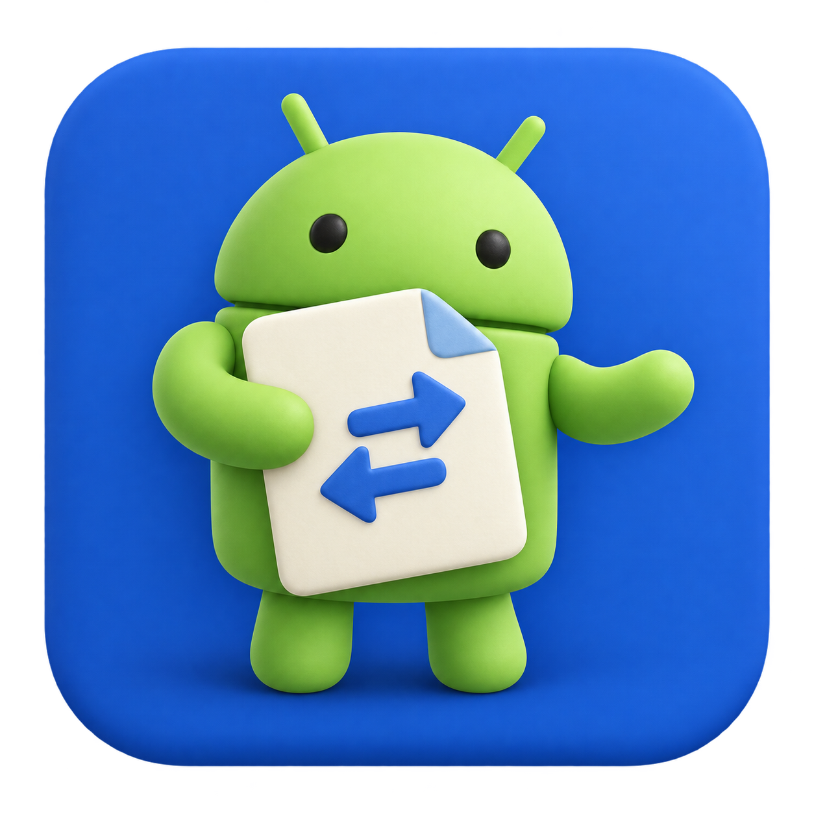

# MacAndFiles



[English](../../README.md) · [한국어](README.ko.md) · [简体中文](README.zh-Hans.md) · [繁體中文](README.zh-Hant.md) · [Español](README.es.md) · [Português](README.pt-BR.md) · [日本語](README.ja.md) · [Deutsch](README.de.md) · [Français](README.fr.md) · [Русский](README.ru.md) · [हिन्दी](README.hi.md) · [Bahasa Indonesia](README.id.md) · [العربية](README.ar.md)

Una app nativa SwiftUI para transferir archivos entre Android y un Mac con Apple Silicon por USB. Interfaz mínima estilo Finder, color de acento del sistema, búsqueda nativa y Liquid Glass. Se instala como app independiente de Google Android File Transfer.

## Requisitos e instalación

Requiere **Apple Silicon / arm64 y macOS 14.0 o posterior**. Verificado en macOS 27.2 y Galaxy Z Fold7; macOS 28, Intel y otros dispositivos no están verificados. Ejecuta `dist/MacAndFiles.app` tras compilar o extrae el ZIP y coloca la app en Aplicaciones. libmtp/libusb están incluidos; no necesitas Homebrew ni Android Studio para ejecutarla. Es una compilación de desarrollo con firma ad-hoc, sin Developer ID ni notarización.

## Conectar y usar

Conecta con un cable USB de datos, desbloquea Android y selecciona «Transferencia de archivos / Android Auto». Cierra Android File Transfer, su Agent y otras apps MTP. Busca dispositivos, selecciona uno y conecta. No requiere depuración USB ni ADB. Haz doble clic en carpetas; ⌘D guarda en Mac, ⌘U envía a Android; también puedes arrastrar archivos de Finder. ⌘↑ sube, ⌘⇧N crea una carpeta y ⌘R actualiza. ⌘F busca solo nombres en la carpeta actual; borrar o Esc restaura la lista. Los elementos ocultos por la búsqueda dejan de estar seleccionados. Más contiene ayuda, desconexión y diagnóstico. Revisa los nombres de archivos antes de compartir registros.

## Idiomas

Sigue el idioma preferido de macOS y el idioma por app en Ajustes del Sistema → General → Idioma y región. Reinicia la app tras cambiarlo. Incluye 13 idiomas; los no incluidos usan inglés. Fechas, tamaños y porcentajes siguen la región. Se conservan nombres de archivos y dispositivos; los diagnósticos de bibliotecas pueden seguir en inglés.

## Comportamiento de transferencia

Una colisión detiene la operación, sin sobrescribir. Las descargas usan archivos temporales y verifican tamaño antes de publicar el nombre final; las subidas verifican el tamaño informado por Android. Cancelar o fallar conserva lo completado y puede dejar archivos parciales en Android. Las carpetas se copian recursivamente con profundidad máxima 128; se rechazan enlaces simbólicos y archivos especiales. El progreso incluye los archivos y bytes de toda la operación. Solo se accede a contenido expuesto por MTP; no incluye borrar, renombrar ni montar volúmenes Finder.

## Compilar y verificar

Necesitas Swift 6.2+, SDK macOS 26+, libmtp 1.1.23 y libusb 1.0.30. El script verifica versiones y SHA-256 de fuentes, e incluye bibliotecas dinámicas y sus fuentes. El archivo de fuentes excluye compilaciones y diagnósticos privados. Los comandos siguientes son diagnósticos de solo lectura, no una CLI general de archivos ni MCP. `--verify-transfer` escribe archivos UUID de prueba: desconecta la GUI y úsalo solo en un dispositivo autorizado; comprueba posibles restos.

```sh
brew install pkg-config
scripts/test.sh
scripts/test-localization.sh
scripts/test-cli.sh
scripts/test-progress.sh
scripts/build-app.sh
scripts/package-source.sh
```

```sh
"dist/MacAndFiles.app/Contents/MacOS/MacAndFiles" --diagnose
"dist/MacAndFiles.app/Contents/MacOS/MacAndFiles" --probe
```

## Licencias y contribuciones

Código, scripts y documentación: **MIT**. Robot Android: **CC BY 3.0**. libmtp/libusb: **LGPL-2.1-or-later**. Conserva licencias y avisos. Android es marca de Google LLC; no es una app oficial. MacAndFiles es un nombre de desarrollo: revisa marca y notarización antes de publicar. El README inglés contiene la referencia técnica completa. Lee AGENT.md para contribuir. Este flujo aún no ha publicado en GitHub.

[English reference](../../README.md) · [Validation](../../VALIDATION.md) · [LICENSE](../../LICENSE) · [Third-party notices](../../THIRD_PARTY_NOTICES.md) · [AGENT.md](../../AGENT.md) · [Release guide](../RELEASING.md) · [Localization guide](../LOCALIZATION.md)

## Terminal y agentes

Instala `maf` con `scripts/install-cli.sh` después de instalar la app. Obtén los identificadores con `maf devices` y `maf storages --device "ID"`. Para listar, subir, descargar y crear carpetas, consulta `maf help` y la [guía CLI](../CLI.md). La salida es JSON; los fallos incluyen códigos de error y un estado de salida distinto de cero. Desconecta el dispositivo en la interfaz antes de usar la CLI.

```sh
maf help
maf devices
maf storages --device "DEVICE_ID"
maf ls --device "DEVICE_ID" --storage 65537 --path /Download
```

## 1.0.0 (9)

Compilada para macOS 14+. Probada en macOS 27.2; faltan pruebas reales en versiones anteriores. Liquid Glass en macOS 26+.

Ve archivos totales y completados, progreso global, velocidad media y tiempo restante estimado. Los archivos completados se conservan si se detiene.

Instala maf desde Más → Terminal y agentes. Añade ~/.local/bin a PATH si es necesario. Desconecta la GUI antes de una operación CLI.

maf comparte el motor de transferencia: resultados JSON, errores estables y estado de la sesión USB para scripts y agentes.

[MacAndFiles](https://macandfiles.pages.dev/es/) · [CLI](../CLI.md) · [Release](../RELEASING.md)
